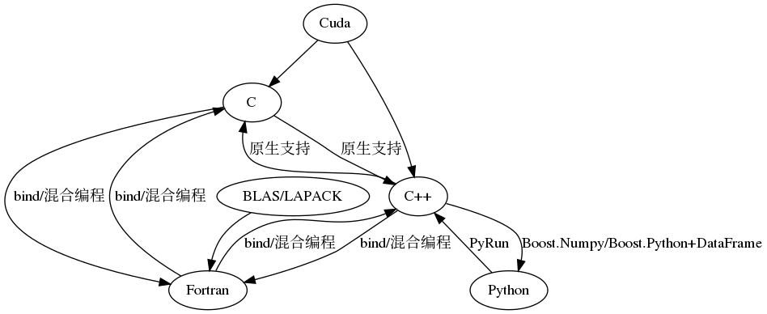

简介
===
该项目主要集中于对Fortran/C/Cpp/Cuda/Python语言间混合编程的实现与测试。

## 框架

语言接口及调用形式见下图:

### Cuda与C/C++接口

具体可以参见[Cuda toolkits 文档](https://docs.nvidia.com/cuda/cuda-installation-guide-linux/index.html)

在这里特别列出Cuda API：
* CUDA Runtime API
        The CUDA runtime API.
* CUDA Driver API
        The CUDA driver API.
* CUDA Math API
        The CUDA math API.
* cuBLAS
        The cuBLAS library is an implementation of BLAS (Basic Linear Algebra Subprograms) on top of the NVIDIA CUDA runtime. It allows the user to access the computational resources of NVIDIA Graphical Processing Unit (GPU), but does not auto-parallelize across multiple GPUs.
* NVBLAS
        The NVBLAS library is a multi-GPUs accelerated drop-in BLAS (Basic Linear Algebra Subprograms) built on top of the NVIDIA cuBLAS Library.
* nvJPEG
        The nvJPEG Library provides high-performance GPU accelerated JPEG decoding functionality for image formats commonly used in deep learning and hyperscale multimedia applications.
* cuFFT
        The cuFFT library user guide.
* nvGRAPH
        The nvGRAPH library user guide.
* cuRAND
        The cuRAND library user guide.
* cuSPARSE
        The cuSPARSE library user guide.
* NPP
        NVIDIA NPP is a library of functions for performing CUDA accelerated processing. The initial set of functionality in the library focuses on imaging and video processing and is widely applicable for developers in these areas. NPP will evolve over time to encompass more of the compute heavy tasks in a variety of problem domains. The NPP library is written to maximize flexibility, while maintaining high performance.
* NVRTC (Runtime Compilation)
        NVRTC is a runtime compilation library for CUDA C++. It accepts CUDA C++ source code in character string form and creates handles that can be used to obtain the PTX. The PTX string generated by NVRTC can be loaded by cuModuleLoadData and cuModuleLoadDataEx, and linked with other modules by cuLinkAddData of the CUDA Driver API. This facility can often provide optimizations and performance not possible in a purely offline static compilation.
* Thrust
        The Thrust getting started guide.
* cuSOLVER
        The cuSOLVER library user guide.
### 线性计算/数值算法库与C/C++/Fortran接口
在Fortran领域，我们众所周知的便是[netlib](http://ntlib.org)的[BLAS](http://www.netlib.org/blas/)/[LAPACK](http://www.netlib.org/lapack/)及[OpenBLAS](https://www.openblas.net/)库，以及mkl及amsl数值库了；然后如果想涉及到并行与MPI的线性计算库，可以学学[PETSc/tao](https://www.mcs.anl.gov/petsc/)。相对来说，C/C++的计算库极多（虽然可能底层也会调用[MKL](https://software.intel.com/en-us/mkl)或者[OpenBLAS](https://www.openblas.net/)/[SuiteSparse](http://faculty.cse.tamu.edu/davis/suitesparse.html)等等）。最经典的，常用的C数值计算库为[GSL](https://www.gnu.org/software/gsl/)，而C++对应的便是[Eigen3](http://eigen.tuxfamily.org/index.php?title=Main_Page)，以及提供两种语言接口的[OpenCV](https://opencv.org/)。当然，最终，我们推荐的是[Boost](https://www.boost.org/)及[Eigen](http://eigen.tuxfamily.org/index.php?title=Main_Page)组合，以及支持GPU的[ATen](https://devhub.io/repos/soumith-ATen)。
### C/C++/Fortran接口
这个问题你可以在Fortran Coder群里问，如果你熟悉了Fortran/C编程，只要数据类型一致，接口匹配，混合编程不难，特别是使用同一套c/fortran编译器，比如pgi/pgc，gcc/g++/gfortran,icc/ifort。

### C/C++与Python接口

虽然Python提供了Cython与ctypes，但是相比而言，使用[Boost.Python](https://www.boost.org/doc/libs/1_63_0/libs/python/doc/html/numpy/index.html)/[Boost.Numpy](https://www.boost.org/doc/libs/1_63_0/libs/python/doc/html/numpy/tutorial/ndarray.html)以及[DataFrame](https://github.com/hosseinmoein/DataFrame)，于对用户开发更加便捷。通过暴露接口的形式可以灵活控制C/C++对象与Python的交互。如果你曾经开发过COM组建，在Windows平台使多种语言可以便捷调用C++对象，那么这次对接受C/C++向Python的交互是十分乐意的简洁形式。